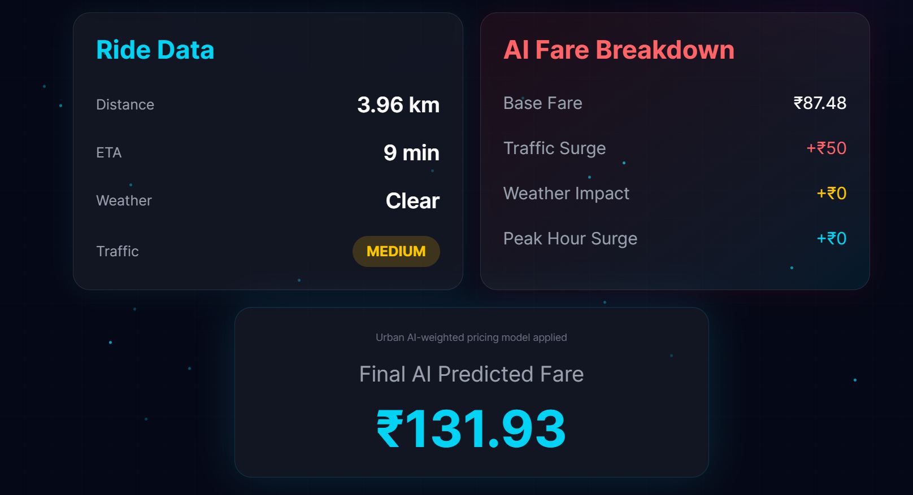
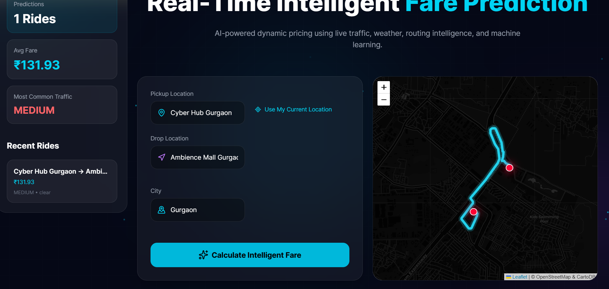

<p align="center">
  <h1 align="center">🚖 SurgeSense AI</h1>
  <p align="center"><strong>AI-Powered Dynamic Pricing Engine for Ride-Hailing Services</strong></p>
  <p align="center">
    
    
    
    
    
  </p>
</p>

---

## 📋 Abstract

SurgeSense AI is an intelligent fare prediction system that combines **gradient-boosted machine learning models** with **real-time traffic and weather data** to generate dynamic pricing for ride-hailing services. The system trains and benchmarks 6 regression models on the **NYC TLC Yellow Taxi dataset**, performs price elasticity analysis, revenue optimization, Monte Carlo risk simulation, and ARIMA demand forecasting — deployed as a full-stack web application.

> **🔬 Research Focus:** Dynamic Pricing × Machine Learning × Financial Engineering

---

<<<<<<< HEAD
## ✨ Key Features
=======
### 📸 Screenshots
#### Fare Prediction



#### Interactive Route Map & Ride History



---

### ✨ Features
>>>>>>> 3007eebf56a88421af730f905942e7fd2be200eb

| Category | Feature |
|---|---|
| **ML Pipeline** | 6 models benchmarked (Linear, Ridge, Lasso, RF, XGBoost, LightGBM) |
| **Feature Engineering** | 16 features including cyclical encoding, interaction terms, demand scoring |
| **Real-Time Data** | Live weather (OpenWeather) + routing (OpenRouteService) |
| **Finance Modules** | Price elasticity, revenue optimization, Monte Carlo VaR, ARIMA forecasting |
| **Validation** | 5-fold CV, ablation study, learning curves, backtesting |
| **Frontend** | React + Tailwind + Leaflet maps with dark mode UI |
| **DevOps** | Docker, GitHub Actions CI/CD, automated tests |

---

## 🏗️ Architecture

<<<<<<< HEAD
```
┌─────────────────────────────────────────────────────────┐
│                    React Frontend                        │
│  ┌──────────┐ ┌──────────┐ ┌──────────┐ ┌────────────┐ │
│  │Prediction│ │ Route    │ │  Fare    │ │  Sidebar   │ │
│  │  Form    │ │  Map     │ │Breakdown │ │  History   │ │
│  └────┬─────┘ └──────────┘ └──────────┘ └────────────┘ │
│       │                                                  │
└───────┼──────────────────────────────────────────────────┘
        │ HTTP/JSON
┌───────▼──────────────────────────────────────────────────┐
│                   FastAPI Backend                         │
│  ┌──────────┐ ┌──────────┐ ┌──────────┐ ┌────────────┐ │
│  │ /predict │ │ /health  │ │/ride-hist│ │  Feature   │ │
│  │          │ │          │ │          │ │  Engine    │ │
│  └────┬─────┘ └──────────┘ └──────────┘ └────────────┘ │
│       │                                                  │
│  ┌────▼─────────────────────────────────────────────┐   │
│  │              XGBoost ML Model                     │   │
│  │  16 features → fare prediction → blend with       │   │
│  │  rule-based calculation (70% ML / 30% rules)      │   │
│  └───────────────────────────────────────────────────┘   │
│       │                    │                              │
│  ┌────▼────┐         ┌────▼────┐                        │
│  │OpenWeather│        │  ORS    │                        │
│  │  API     │         │  API    │                        │
│  └──────────┘         └─────────┘                        │
└──────────────────────────────────────────────────────────┘
=======
### APIs
- OpenWeather API
- OpenRouteService API

---

### 📂 Project Structure

```text
📦 SurgeSense-AI
│
├── 📂 backend                # FastAPI backend
│
├── 📂 frontend               # React + Vite frontend
│
├── 📂 data                    
│
├── 📂 notebooks
│
├── 📂 outputs
│
├── 📜 requirements.txt       # Python dependencies
├── 📜 .gitignore
└── 📜 README.md
>>>>>>> 3007eebf56a88421af730f905942e7fd2be200eb
```

---

## 🔬 Methodology

### Feature Engineering (16 Features)

| Feature | Type | Rationale |
|---|---|---|
| `distance` | Continuous | Primary fare driver |
| `hour_sin`, `hour_cos` | Cyclical | Preserves 23→0 hour proximity |
| `is_peak`, `is_night` | Binary | Temporal demand indicators |
| `traffic_encoded` | Ordinal | Speed-derived traffic level |
| `weather_encoded` | Ordinal | Weather severity |
| `distance_squared` | Polynomial | Non-linear distance effects |
| `distance_log` | Transform | Diminishing marginal cost |
| `distance_bucket` | Categorical | Discrete pricing tiers |
| `distance_traffic` | Interaction | Surge × distance scaling |
| `distance_peak` | Interaction | Peak × distance |
| `traffic_peak` | Interaction | Compound surge |
| `weather_peak` | Interaction | Weather-peak compound |
| `demand_score` | Composite | Aggregate demand indicator |

### Models Evaluated

| Model | Key Parameters |
|---|---|
| Linear Regression | Baseline |
| Ridge | α = 1.0, 10.0 |
| Lasso | α = 0.1, 1.0 |
| Random Forest | n=200, depth=15 |
| **XGBoost** | n=300, depth=8, lr=0.05 |
| LightGBM | n=300, depth=8, lr=0.05 |

---

## 💰 Finance Modules

### Price Elasticity of Demand
Analyzes how demand changes with price across conditions (peak/off-peak, weather, traffic).

### Revenue Optimization
Finds the revenue-maximizing price using `scipy.optimize.minimize_scalar`:
```
R(P) = P × D₀ × (P/P_ref)^ε
```

### Monte Carlo Simulation
10,000 random scenarios → fare distribution → VaR at 95% and 99% confidence.

### ARIMA Demand Forecasting
ARIMA(2,1,2) model for 48-hour demand prediction with confidence intervals.

### Strategy Backtesting
Compares Fixed, Simple Surge, Rule-Based, and ML pricing on historical data.

---

## 🛠️ Tech Stack

| Layer | Technology |
|---|---|
| **Backend** | Python 3.11, FastAPI, Pydantic |
| **ML** | XGBoost, LightGBM, Scikit-learn, Statsmodels |
| **Frontend** | React 18, Vite, Tailwind CSS, Leaflet, Framer Motion |
| **Database** | SQLite |
| **APIs** | OpenWeather, OpenRouteService |
| **DevOps** | Docker, GitHub Actions |
| **Testing** | pytest, flake8 |

---

## 📁 Project Structure

```
dynamic_pricing/
├── backend/
│   └── main.py                 # FastAPI backend (API, features, prediction)
├── ml/
│   ├── data_loader.py          # NYC TLC data download & processing
│   ├── train_pipeline.py       # Multi-model training + evaluation
│   ├── demand_elasticity.py    # Price elasticity analysis
│   ├── revenue_optimizer.py    # Revenue optimization (scipy)
│   ├── monte_carlo.py          # Monte Carlo simulation
│   ├── time_series.py          # ARIMA demand forecasting
│   └── backtester.py           # Strategy backtesting
├── frontend/
│   └── src/
│       ├── App.jsx             # Main app component
│       └── components/         # 10 React components
├── tests/
│   ├── test_features.py        # Feature engineering tests
│   ├── test_api.py             # API endpoint tests
│   └── test_model.py           # Model prediction tests
├── data/                       # Training data
├── outputs/
│   ├── saved_models/           # Trained model files
│   ├── results/                # CSV evaluation results
│   └── plots/                  # Generated analysis plots
├── docs/
│   ├── technical_report.md     # Academic-style paper
│   └── API_REFERENCE.md        # API documentation
├── Dockerfile                  # Backend container
├── docker-compose.yml          # Full-stack deployment
├── .github/workflows/ci.yml    # CI/CD pipeline
├── requirements.txt            # Python dependencies
└── README.md
```

---

## 🚀 Quick Start

### Option 1: Docker (Recommended)

```bash
# Clone and configure
git clone https://github.com/yourusername/dynamic-pricing.git
cd dynamic-pricing
cp .env.example .env
# Add your API keys to .env

# Run everything
docker-compose up --build
```

### Option 2: Manual Setup

**Backend:**
```bash
pip install -r requirements.txt
cd backend && uvicorn main:app --reload
```

**Frontend:**
```bash
cd frontend && npm install && npm run dev
```

---

## 🤖 ML Pipeline Commands

```bash
# Step 1: Download real NYC taxi data
python -m ml.data_loader

# Step 2: Train all models + generate results
python -m ml.train_pipeline

# Step 3: Run finance analysis modules
python -m ml.demand_elasticity
python -m ml.revenue_optimizer
python -m ml.monte_carlo
python -m ml.time_series
python -m ml.backtester
```

---

## 🧪 Testing

```bash
# Run all tests
pytest tests/ -v

# Run specific test suites
pytest tests/test_features.py -v    # Feature engineering
pytest tests/test_api.py -v         # API endpoints
pytest tests/test_model.py -v       # Model predictions

# Lint
flake8 backend/ ml/ --max-line-length=120
```

---

## 🔮 Research Extensions

- [ ] Reinforcement learning for adaptive pricing
- [ ] Graph Neural Networks for spatial demand modeling
- [ ] Real-time traffic API integration (Google Maps, TomTom)
- [ ] Multi-city transfer learning
- [ ] A/B testing framework for pricing strategies
- [ ] Fairness constraints in pricing optimization

---

## 📚 Academic References

1. Chen, M. K., & Sheldon, M. (2016). Dynamic pricing in a labor market: Surge pricing and flexible work on the Uber platform. *ACM EC*.
2. Cachon, G. P., et al. (2017). The role of surge pricing on a service platform. *M&SOM*, 19(3).
3. Talluri, K. T., & Van Ryzin, G. J. (2004). *The Theory and Practice of Revenue Management*. Springer.
4. Ye, J., et al. (2018). How to build a graph-based deep learning architecture for ride demand prediction. *arXiv:1812.04858*.
5. Box, G. E. P., & Jenkins, G. M. (1976). *Time Series Analysis*. Holden-Day.
6. Moreira-Matias, L., et al. (2013). Predicting taxi-passenger demand using streaming data. *IEEE TITS*, 14(3).

---

## 👤 Author

**Aditya Singh** — B.Tech Student

---

## 📄 License

This project is licensed under the MIT License — see [LICENSE](LICENSE) for details.
