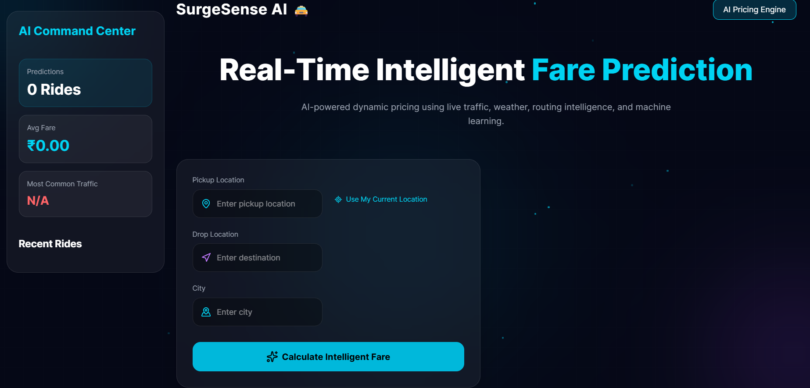

# 🚕 SurgeSense AI

## An AI-powered intelligent cab fare prediction platform that uses machine learning, live weather data, route intelligence, and traffic estimation to generate realistic ride fare predictions in real time.

---

### 🌐 Live Demo

#### Frontend
[SurgeSense AI](https://surgesense-ai.vercel.app/)

#### Backend API
[Render Deployment](https://surgesense-ai.onrender.com/)

---

### 📸 Screenshots
#### Fare Prediction


#### Interactive Route Map & Ride History


---

### ✨ Features

#### 🚖 Real-Time Fare Prediction
Predict ride fares instantly using an XGBoost machine learning model.

#### 🌦 Live Weather Integration
Fetches real-time weather data using OpenWeather API.

#### 🗺 Route Intelligence
Calculates ride distance and ETA using OpenRouteService.

#### 🚦 Traffic Estimation
Estimates traffic levels from route speed and travel duration.

#### 📊 Interactive Dashboard
Displays:
- Fare breakdown
- Distance
- ETA
- Weather conditions
- Traffic level

#### 📝 Ride History
Stores previous predictions inside a SQLite database.

#### 🤖 Machine Learning Powered
Uses engineered features and XGBoost regression to model dynamic pricing behavior.

---

### 🛠 Tech Stack
- React
- FastAPI
- SQLite
- XGBoost
- Scikit-Learn
- Pandas
- NumPy

### APIs
- OpenWeather API
- OpenRouteService API

---

### 📂 Project Structure

```text
📦 SurgeSense-AI
│
├── 📂 backend                # FastAPI backend
│
├── 📂 frontend               # React + Vite frontend
│
├── 📂 data                    
│
├── 📂 notebooks
│
├── 📂 outputs
│
├── 📜 requirements.txt       # Python dependencies
├── 📜 .gitignore
└── 📜 README.md
```

---

### 🛠 Local Setup & Installation

#### 1️⃣ Clone the repository

```bash
git clone https://github.com/aditya27singh/dynamic-pricing.git
cd dynamic-pricing
```

#### 2️⃣ Create and activate a virtual environment

**Windows**

```bash
python -m venv .venv
.venv\Scripts\activate
```

**Mac/Linux**

```bash
python3 -m venv .venv
source .venv/bin/activate
```

#### 3️⃣ Install backend dependencies

```bash
pip install -r requirements.txt
```

#### 4️⃣ Configure environment variables

Create a `.env` file in the project root:

```env
OPENWEATHER_API_KEY=your_api_key
OPENROUTESERVICE_API_KEY=your_api_key
```

#### 5️⃣ Start the backend server

```bash
uvicorn backend.main:app --reload
```

Backend runs on:

```text
http://127.0.0.1:8000
```

#### 6️⃣ Start the frontend

Open a new terminal:

```bash
cd frontend
npm install
npm run dev
```

Frontend runs on:

```text
http://localhost:5173
```

#### 7️⃣ Open the application

Visit:

```text
http://localhost:5173
```

and start generating AI-powered fare predictions.

---

### 🔮 Future Improvements

- Add an AI Fare Advisor that recommends the best time to book a ride, such as: "Wait 5 minutes, and your fare could drop by ₹40 based on current demand trends."
- Real traffic API integration
- Multi-city fare optimization
- Add advanced model evaluation dashboards with feature importance visualizations and prediction error analysis.
- Deep Learning based fare prediction
- Dynamic demand heatmaps

---

### 👨‍💻 Author
Aditya Singh

---

### ⚖️ License  
MIT License – Feel free to use and modify!  
